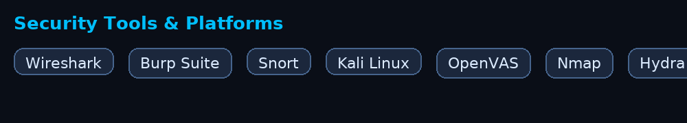

<!--
  GitHub Profile README for Harshith Jella (jellaharshith)
  Files needed in repo root: harshith_cyber_skills (1).gif, tools_banner.gif
-->

<h1 align="left">Hi 👋, I'm Harshith Jella</h1>
<h3 align="left">🔒 Cybersecurity Enthusiast | 🧠 Security Researcher | 🐍 Python Practitioner</h3>

---

## 👨‍💻 About Me
I’m **Harshith Jella**, a **Cybersecurity & AI Developer** and **Computer Science undergrad** at **California State University, East Bay** (GPA **3.89**, graduating **Spring 2027**).  
I focus on **cyber defense, ethical hacking, and AI-driven detection**—building practical security labs and sharing reproducible notes.

**Currently exploring:** Threat detection automation · SOC operations · Red/Blue team practices · Cloud security fundamentals

---

## 🧰 Cybersecurity Skills
**Security Domains:** Network Security · Ethical Hacking · Penetration Testing · Threat Detection · Incident Response · Vulnerability Assessment · Digital Forensics  
**Tools & Frameworks:** Kali Linux · Metasploit · Wireshark · Nmap · OpenVAS · Splunk · UFW/iptables · VirtualBox · MITRE ATT&CK  
**Techniques:** Security Analysis · System Hardening · Red/Blue Team Exercises · Log Analysis · Malware Detection · Firewall Configuration  
**Programming for Security:** Python (automation & analysis) · Bash  
**Soft Skills:** Analytical Thinking · Problem Solving · Communication · Leadership · Collaboration  

---

## 🪪 Certifications
- 🎓 **Executive PG Certification — Cybersecurity & Ethical Hacking** — *IIT Roorkee (2025)*  
- 💡 **Certified Ethical Hacker (CEH v11)** — *EC-Council (2022)*  
- 🔐 **Introduction to Cybersecurity** — *Cisco (2023)*  

---

---

## 🧰 Security Tools 

  

---

## 🔗 Connect

---

